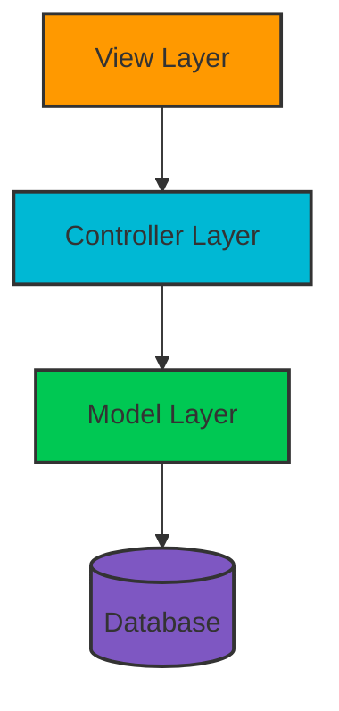

# Layer Architecture Framework

<div align="center">

[](https://github.com/ChamathDilshanC/Layer_Architecture_Final/stargazers)
[](https://www.oracle.com/java/)
[](LICENSE)
[](https://maven.apache.org/)

</div>

## 🚀 Overview

A robust implementation of the layered architecture pattern for standalone Java applications. This framework demonstrates clean separation of concerns through well-defined service layers, data access patterns, and business logic organization. Built with Java 17+ and Maven, it provides a solid foundation for building maintainable Java applications.

## ✨ Key Features

<div align="center">

| Feature | Description |
|---------|------------|
| 🏗️ **Three-tier Architecture** | Clear separation between service, business, and data layers |
| 📦 **Modular Design** | Discrete Maven modules for better maintenance |
| 🔐 **JPA/Hibernate** | Type-safe database operations with connection pooling |
| 🧪 **Comprehensive Testing** | Unit and integration tests with JUnit 5 |
| 🛠️ **Build Automation** | Maven-based build lifecycle management |

</div>

## 🎯 Architecture



## 🛠️ Tech Stack

<div align="center">

| Technology | Version | Purpose |
|------------|---------|----------|
| Java | 17+ | Core Programming Language |
| Maven | 3.9.6 | Build and Dependency Management |
| JUnit | 5.9.2 | Testing Framework |
| Mockito | 5.10.0 | Mocking Framework |
| H2 Database | 2.2.224 | Development Database |
| PostgreSQL | 15+ | Production Database |
| Hibernate | 6.2+ | ORM Framework |

</div>

## 📁 Project Structure

```
src/
├── main/
│   ├── java/
│   │   ├── view/          # View components and UI logic
│   │   ├── controller/    # Controllers handling user input
│   │   ├── model/         # Domain models and data access
│   │   └── config/        # Application configuration
│   └── resources/
│       ├── config/        # Configuration files
│       └── db/            # Database migration scripts
└── test/
    └── java/             # Unit and integration tests
```

## 🚀 Quick Start

### Prerequisites

- Java 17 JDK
- Maven 3.9+
- PostgreSQL 15+ (for production)

### Setup

```bash
# Clone the repository
git clone https://github.com/ChamathDilshanC/Layer_Architecture_Final.git

# Navigate to project directory
cd Layer_Architecture_Final

# Build the project
mvn clean install

# Run the application
java -jar target/layer-architecture.jar
```

## 🌟 Features in Detail

1. **Layered Architecture**
   - Clear separation between service, business, and data access layers
   - Dependency injection for loose coupling
   - Interface-based design for flexibility

2. **Data Access Layer**
   - JPA/Hibernate implementation
   - Connection pooling
   - Transaction management
   - Entity lifecycle management

3. **Business Layer**
   - Domain-driven design principles
   - Business logic encapsulation
   - Validation and business rules

4. **Testing**
   - Unit tests with JUnit 5
   - Integration tests
   - Mockito for mocking dependencies

## 🤝 Contributing

We welcome contributions! Here's how you can help:

1. Fork the repository
2. Create your feature branch (`git checkout -b feature/AmazingFeature`)
3. Commit your changes (`git commit -m 'Add some AmazingFeature'`)
4. Push to the branch (`git push origin feature/AmazingFeature`)
5. Open a Pull Request

## 📬 Connect With Me

<div align="center">

[](https://github.com/ChamathDilshanC)
[](https://www.linkedin.com/in/chamathdilsahnc/)

</div>

## 📄 License

This project is licensed under the MIT License - see the [LICENSE](LICENSE) file for details.

---

<div align="center">

Made with ❤️ by [Chamath Dilshan](https://github.com/ChamathDilshanC)

⭐ Star this repository if you find it helpful!

</div>
